# Image Management Tool

## Student Info

- course: INFO 5100
- name: Zihan Zhao
- NUID: 001265988

## Class Diagram

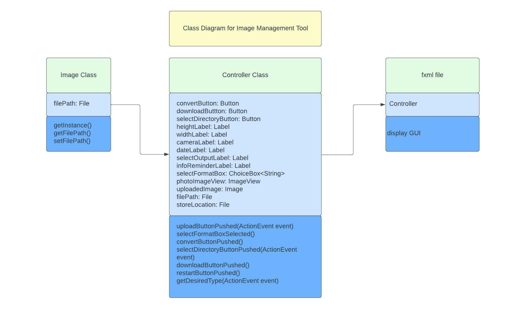

## Tests

### 1、source image

- image name: s_201052592911
- image format: .jpg

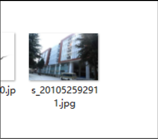

### 2、GUI design

- left side is designed for displaying image thumbnails
- middle side is designed for displaying image info
- right side is designed for image operations

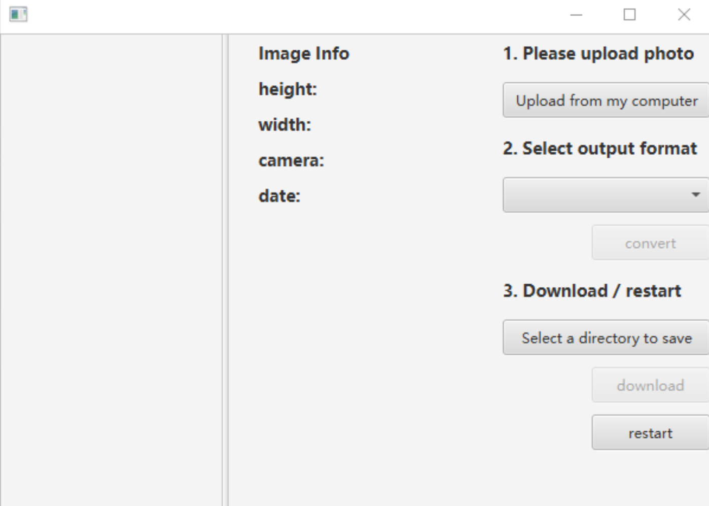

### 3、upload image

- Click on the "Upload from my computer" button, then select and upload the image

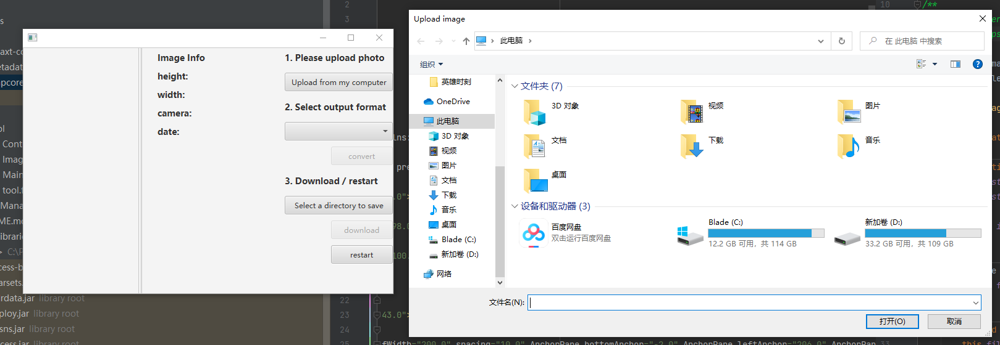

- After uploading, the thumbnail and some basic information of the image will be displayed on GUI

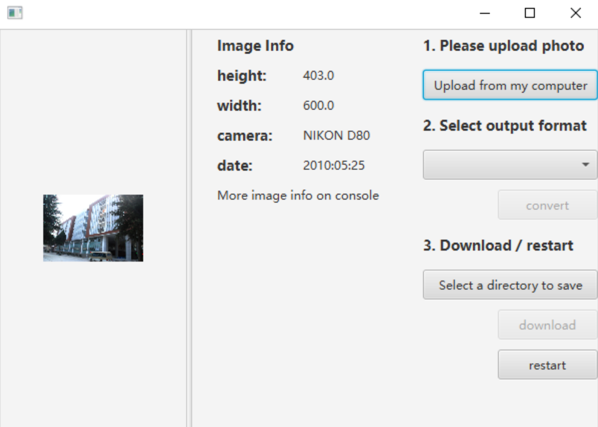

- Since many photos hide their metadate including location and date. I used an outside library called metadata-extractor to get all the hidden data and print it to the console

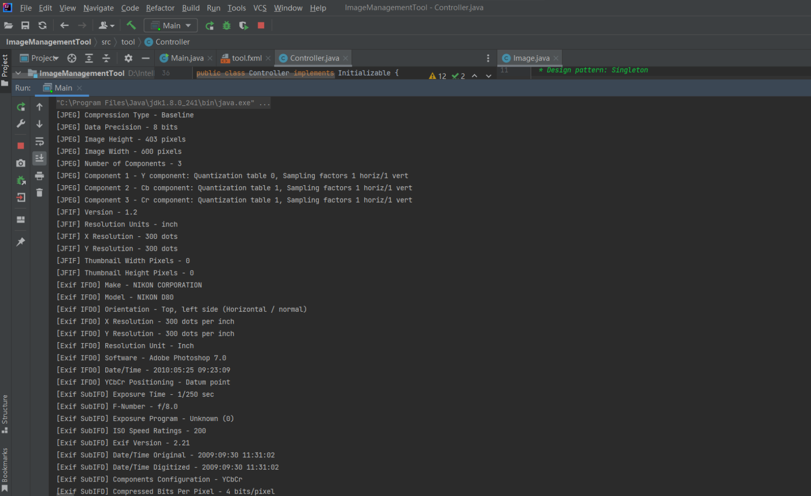

### 4、convert image

- First, users needs to select the output they want, and only after they have uploaded the image and selected the desired output format, then the convert button would be enabled.

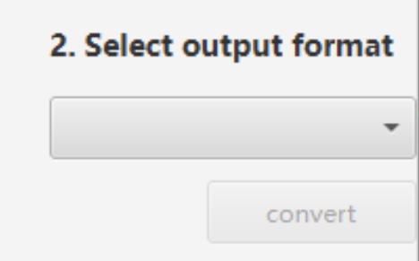

- The javaxt package only accepts the following formats for input and output

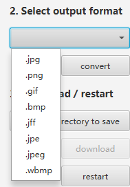

- After selection, the "selectOuputLabel" will display the format that users selected, then users can hit the convert button, and the software will memorize the desired output in the computer memory

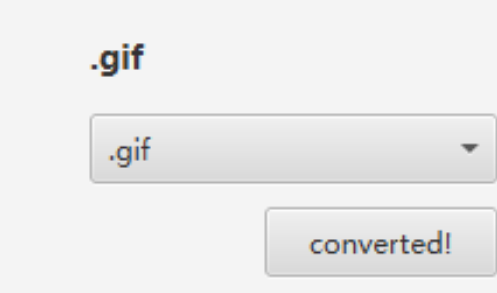

### 5、download converted image

- First, same as uploading, users need to push the "Select a directory to save" button to select a directory in their computer to save the converted image

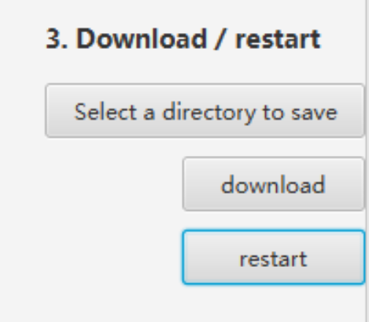

- After the selection, the "Select a directory to save" button will change to the directory that users just selected

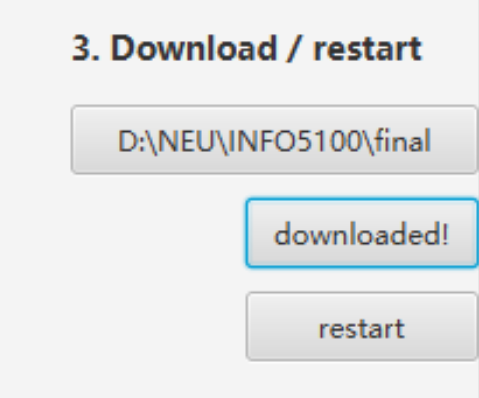

- The last step is to hit the download button and the image will be saved
- The following image is converted and downloaded using this image management tool
- The output format and location are correct

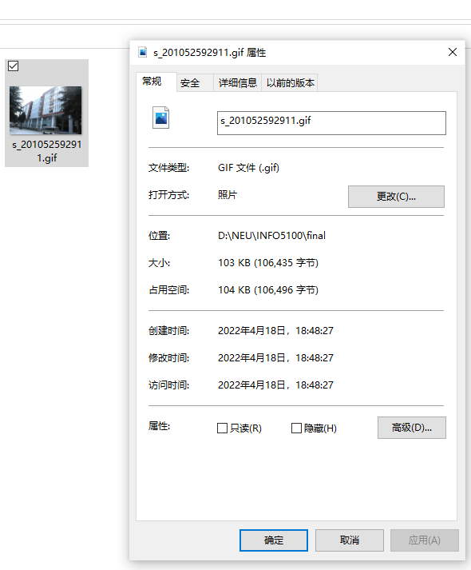

### 6、restart and continue the process

- A "restart" button is designed to allow users to continue to upload other images

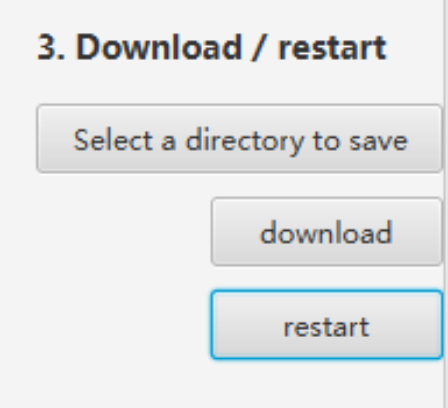

- What this button does is resetting every variables and labels to default values

 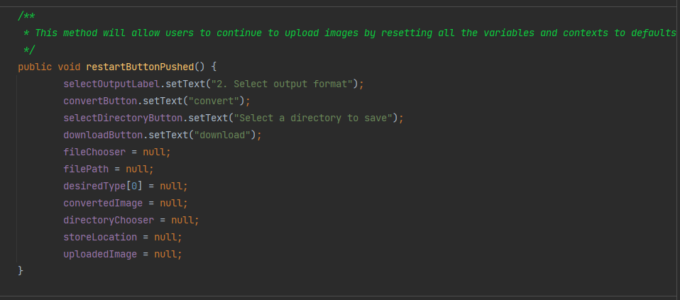

### Hope this file explains well about the design and functions of the software, thank you for time reading this!